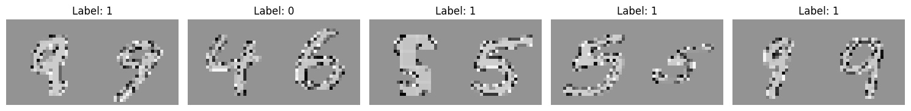
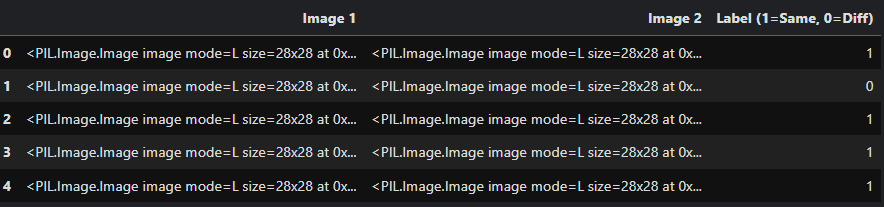
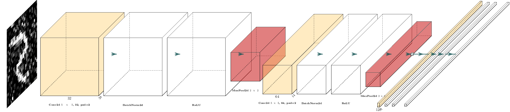
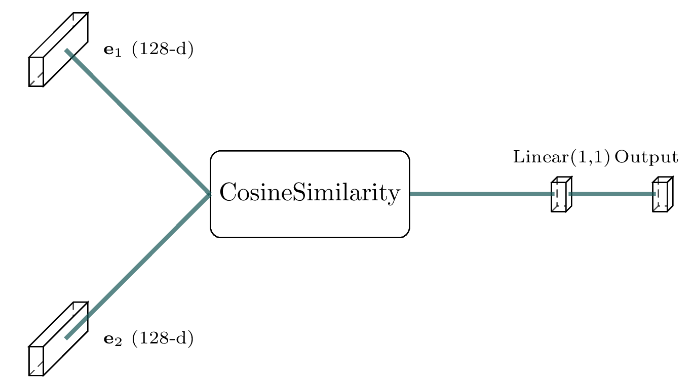
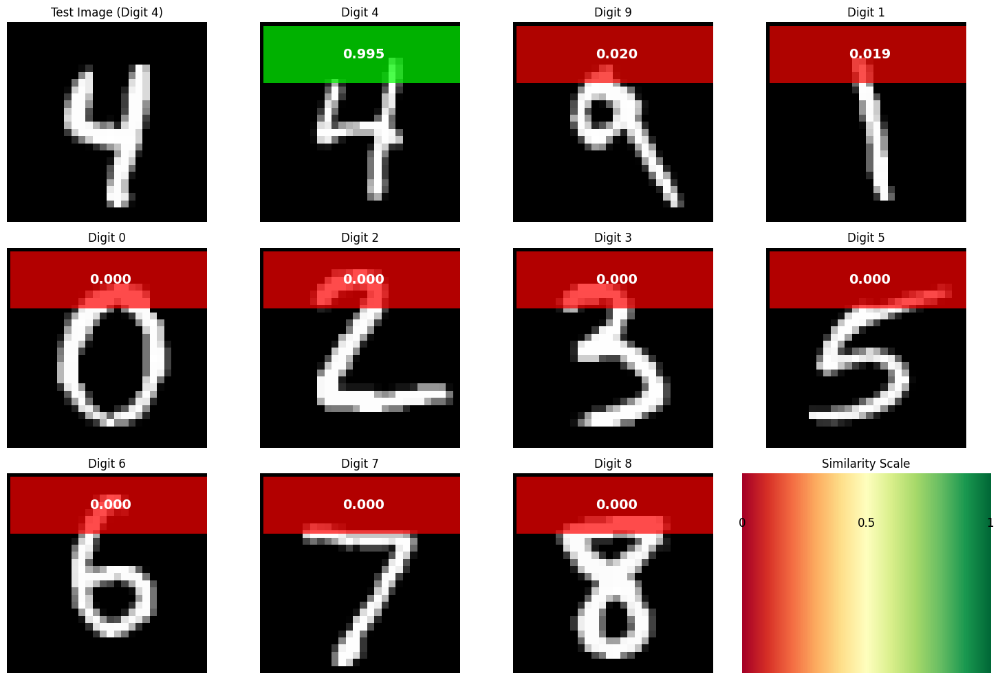
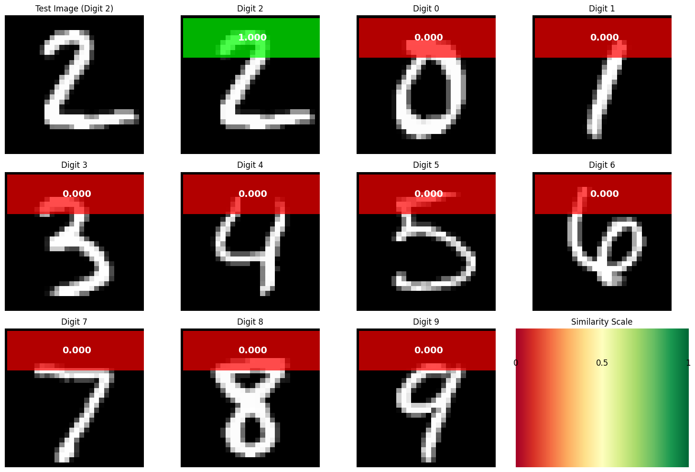

# Image Similarity Neural Network

A Siamese neural network implementation for calculating similarity between pairs of images using the MNIST dataset. This project is implemented as an interactive Jupyter notebook with comprehensive visualizations and step-by-step explanations.

## Problem Statement

The goal of this project is to train a neural network that can calculate the similarity between pairs of images. The network distinguishes whether two images belong to the same class or not, using the MNIST dataset as a benchmark.

## Methodology

This implementation uses a **Siamese neural network** architecture that learns to embed images into a feature space where:

- Similar images (same class) are close together
- Dissimilar images (different classes) are far apart

The network is trained using pairs of images with binary labels indicating whether the images are from the same class (similar=1) or different classes (dissimilar=0). Cosine similarity between embeddings serves as the similarity metric, and the network is trained with binary cross-entropy loss.

## Architecture Overview

### 1. Embedding Network

- **Input**: 28×28×1 MNIST images
- **Architecture**:
  - Two convolutional blocks (Conv2d → BatchNorm → ReLU → MaxPool)
  - Fully connected layers with BatchNorm and ReLU
  - L2 normalization for unit-length embeddings
- **Output**: 128-dimensional normalized embedding vectors

### 2. Similarity Model

- Takes two images as input
- Computes embeddings using the shared embedding network
- Calculates cosine similarity between embeddings
- Applies a learnable projection layer for binary classification

## Implementation Details

### Data Preparation

- **Transform**: Converts images to tensors with normalization (mean=0.1307, std=0.3081)
- **Pair Generation**: Custom `PairDataset` class creates pairs with 50% positive (same class) and 50% negative (different class) samples

### Training Configuration

- **Optimizer**: Adam (lr=1e-2, weight_decay=1e-5)
- **Loss Function**: Binary Cross-Entropy with Logits
- **Scheduler**: ReduceLROnPlateau (patience=2, factor=0.5)
- **Batch Size**: 256
- **Epochs**: 30

## Code Structure

The implementation is organized into several key components:

1. **Data Loading and Preprocessing**: MNIST dataset loading with normalization transforms
2. **PairDataset Class**: Custom dataset for generating positive/negative image pairs
3. **EmbeddingNet Architecture**: Convolutional neural network for feature extraction
4. **SimilarityModel**: Siamese network combining embeddings with cosine similarity
5. **Training Setup**: Loss function, optimizer, and evaluation utilities
6. **Training Loop**: Main training process with validation and checkpointing
7. **Visualization**: Results analysis and similarity visualization tools

## Requirements

- `torch` - PyTorch deep learning framework
- `torchvision` - Computer vision datasets and transforms
- `matplotlib` - Plotting and visualization
- `numpy` - Numerical computing
- `pandas` - Data manipulation and analysis
- `jupyter` - Jupyter notebook environment

## Installation and Usage

1. **Clone the repository**:

   ```bash
   git clone https://github.com/HasanAbdelhady/Calculating-Image-Similarity-using-Neural-Networks.git
   ```

2. **Install dependencies**:

   ```bash
   pip install torch torchvision matplotlib numpy pandas jupyter
   ```

3. **Run the Jupyter notebook**:

   ```bash
   jupyter notebook
   ```

   Then open the main notebook file and run all cells sequentially. The notebook includes:

   - Data loading and preprocessing
   - Model architecture definitions
   - Training loop with progress monitoring
   - Results visualization and analysis

## Key Features

- **Siamese Architecture**: Shared weights between twin networks for consistent feature extraction
- **Cosine Similarity**: Uses normalized embeddings for robust similarity computation
- **Balanced Dataset**: Automatic generation of positive/negative pairs
- **Mixed Precision**: Optimized training with automatic mixed precision (when GPU available)
- **Visualization**: Comprehensive similarity visualization with color-coded results

## Model Architecture Details

### Embedding Network Flow

```
Input (28×28×1) → Conv2d(1→32) → BatchNorm → ReLU → MaxPool(2×2) →
Conv2d(32→64) → BatchNorm → ReLU → MaxPool(2×2) →
Flatten → Linear(3136→128) → BatchNorm → ReLU → L2_Normalize → Output (128-dim)
```

### Training Process

1. **Pair Generation**: Creates balanced pairs of similar/dissimilar images
2. **Forward Pass**: Computes embeddings for both images in a pair
3. **Similarity Calculation**: Uses cosine similarity between normalized embeddings
4. **Loss Computation**: Binary cross-entropy loss for classification
5. **Optimization**: Adam optimizer with learning rate scheduling

## Results

The trained model achieves:

- High accuracy in distinguishing between similar and dissimilar image pairs
- Meaningful similarity scores (higher for same-class pairs, lower for different-class pairs)
- Robust performance across different MNIST digit classes

### Dataset Visualization


_Figure 1: Visualization of the PairDataset showing how similar and dissimilar image pairs are constructed from MNIST digits._


_Figure 2: Structure of the paired dataset showing labels where 1 indicates similar pairs (same class) and 0 indicates dissimilar pairs (different classes)._

### Architecture Visualization


_Figure 3: 3D visualization of the EmbeddingNet architecture showing the convolutional blocks and fully connected layers._


_Figure 4: Visual representation of the Similarity Model showing how cosine similarity is computed between image embeddings._

### Model Results


_Figure 5: Example pairs of images with their predicted similarity scores from the trained model._


_Figure 6: Additional examples showing comprehensive similarity comparisons between a test image and various digit classes._

### Visualization Features

- **Similarity Matrix**: Shows how a test image compares to all digit classes
- **Color Coding**: Green for high similarity, red for low similarity
- **Ranked Results**: Displays digits ranked by similarity score
- **Probability Scores**: Both raw cosine similarity and sigmoid probability

## Technical Implementation Notes

- **Memory Optimization**: Uses `pin_memory=True` and `non_blocking=True` for faster GPU transfers
- **Reproducibility**: Includes proper random seeding and deterministic behavior options
- **Efficiency**: Implements efficient data loading with multiple workers and persistent workers
- **Checkpointing**: Automatically saves the best model as "best_model.pt" based on validation loss

## Usage Examples

After running the training cells in the notebook, you can use the model to compute similarities:

```python
# The trained model is available in the notebook context
model.eval()

# Compute similarity between two images
with torch.no_grad():
    similarity = model.get_raw_similarity(img1, img2)
    print(f"Similarity score: {similarity.item():.4f}")

# Or get the projected similarity logit
logit = model(img1, img2)
probability = torch.sigmoid(logit)
print(f"Similarity probability: {probability.item():.4f}")
```

## License

This project is available for educational and research purposes.

## Contributing

Feel free to submit issues, feature requests, and pull requests to improve the implementation.
